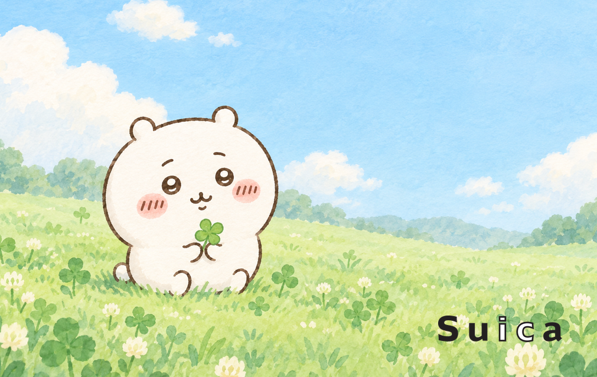
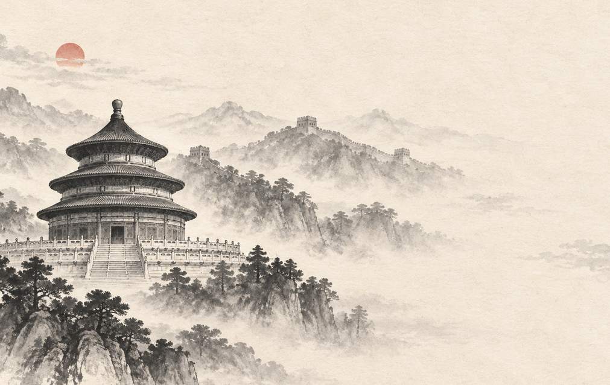
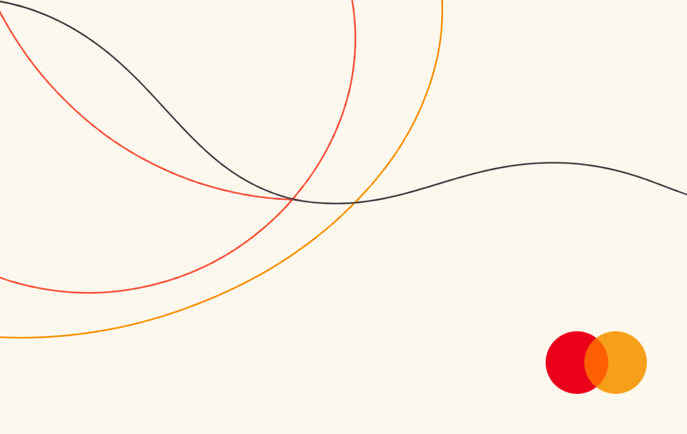

# card-creator-skill

一个用于生成 AirCard、NFC 卡片和交通卡卡面的 Codex Skill。仓库当前只维护三类内容：

- 标准卡面尺寸、出血区和安全区规则。
- 有来源记录的透明交通/支付贴纸素材。
- 将 AI 背景图裁切、缩放并叠加贴纸的确定性脚本。

它不包含在线编辑器，也不会让图像模型重画品牌 Logo。

## 安装

把技能目录复制到 Codex skills 目录：

```bash
cp -R skills/card-creator ~/.codex/skills/
```

脚本依赖：

```bash
python3 -m pip install -r skills/card-creator/scripts/requirements.txt
```

之后可以这样调用：

```text
Use $card-creator to create a quiet Guangzhou morning card face,
reserve the upper-right for the China T-Union sticker, and export print-ready PNGs.
```

## 输出规格

- 成品裁切尺寸：`1011 × 638 px`，300 DPI，对应 `85.60 × 53.98 mm`。
- 含出血尺寸：`1081 × 708 px`，四边各 `35 px` 出血。
- 重要内容安全边距：裁切线内缩 `59 px`。
- 输出包含 `bleed`、`trim` 和 `guides` 三张 PNG。

## 卡面示例与 Prompt

ImageGen 只负责无文字、无 Logo 的背景；`card-creator` 再将清单中 `status: ready` 的
透明贴纸确定性叠加到安全区内。下面的预览限制为 `600 px` 宽，仓库仍保留完整
`1011 × 638 px` 裁切图。

### 1. Chiikawa × Suica

<p align="center">
  
</p>

贴纸：`suica`（`ready`）。非官方、非商业同人示例；不代表角色或交通卡权利方授权、合作或认可。

<details>
<summary>查看背景 Prompt</summary>

```text
Use case: illustration-story
Asset type: print-ready transit card background artwork
Primary request: Create a fresh, cute Chiikawa-themed card-face illustration featuring Chiikawa alone, with a gentle happy expression, sitting in a tiny spring meadow with a few small clover leaves and soft rounded clouds.
Scene/backdrop: airy pale mint-green meadow fading into a clear powder-blue sky, subtle watercolor-and-gouache texture, very clean and uncluttered.
Subject: one recognizable Chiikawa character, full body visible, placed slightly left of center and comfortably inside the central safe area.
Style/medium: polished kawaii Japanese character illustration, soft hand-painted watercolor and gouache, simple rounded shapes, delicate texture, crisp clean edges.
Composition/framing: flat edge-to-edge landscape artwork, 1.58577:1 composition; important content centered within a generous safe area; leave calm clean negative space in the lower-right for a later transparent Suica transit sticker; background extends fully to every edge.
Lighting/mood: bright soft morning light, fresh, calm, cheerful, adorable.
Color palette: pale mint, soft grass green, powder blue, cream white, tiny touches of warm peach.
Text: none.
Constraints: background artwork only; no logo, no brand mark, no Suica text, no Japanese text, no lettering, no card number, no QR code, no barcode, no watermark; no extra characters; no card mockup, no hand, no perspective, no border, no rounded-corner mask, no shadow; keep the lower-right negative space free of important elements.
```

</details>

### 2. 北京水墨交通卡背景

<p align="center">
  
</p>

状态：背景已完成，并为“交通联合”和“北京一卡通”预留右侧双贴纸位。两个标志目前仍是
`pending`，所以此示例没有调用非自由 SVG、官网页头图或 AI 近似 Logo；待合格素材进入
`ready` 后即可确定性补齐。

<details>
<summary>查看背景 Prompt</summary>

```text
Use case: stylized-concept
Asset type: print-ready transit card background artwork
Primary request: Create a refined Beijing-themed Chinese ink-wash card-face background, calm, contemporary, and fully printable edge to edge.
Scene/backdrop: the entire rectangular canvas is filled with warm ivory rice paper; misty layered ink landscape with a restrained Temple of Heaven and a distant Great Wall, broad atmospheric blank paper on the right.
Subject: one complete Temple of Heaven painted in elegant black and gray ink wash, scaled modestly and placed in the left third with at least 12% clear paper margin from the left and bottom edges so the entire building and roof remain visible; the Great Wall runs softly through the middle distance; no people.
Style/medium: traditional Chinese shui-mo ink painting with modern editorial restraint, visible dry-brush texture, soft ink diffusion, subtle handmade paper grain.
Composition/framing: flat edge-to-edge landscape artwork, 1.58577:1 composition; keep the complete Temple of Heaven and all important landmarks inside a generous central safe area; reserve two calm clean warm-white negative-space zones along the right side for later transparent China T-Union and Beijing transit stickers; rice-paper background reaches every canvas edge.
Lighting/mood: quiet early morning mist, dignified, spacious, poetic.
Color palette: warm rice-paper ivory, charcoal black, soft gray, one small muted cinnabar sun.
Text: none.
Constraints: opaque rectangular background artwork only; no cropped architecture, no black voids, no transparent areas, no circular ink frame, no vignette, no heavy border; no logo, no brand mark, no transit symbol, no Chinese characters, no lettering, no card number, no QR code, no barcode, no watermark; no card mockup, no hand, no perspective, no rounded-corner mask, no shadow; keep both right-side reserved zones free of important elements.
```

</details>

### 3. 极简线条 × Mastercard

<p align="center">
  
</p>

贴纸：红橙双色 `mastercard`（`ready`）。ImageGen 返回透明底时，只将背景修正为不透明暖象牙白；
Mastercard 双圆标志仍由 Skill 使用已核验 PNG 叠加，不让模型重画。

<details>
<summary>查看背景 Prompt</summary>

```text
Use case: stylized-concept
Asset type: print-ready payment card background artwork
Primary request: Create an elegant ultra-minimal line-art card-face background designed to pair with a later full-color Mastercard symbol.
Scene/backdrop: smooth warm ivory field with a few precise continuous lines forming two large overlapping circular arcs and a subtle flowing path, abstract rather than illustrative.
Style/medium: premium Swiss-influenced minimal graphic design, crisp monoline geometry, restrained editorial composition, flat matte print finish.
Composition/framing: flat edge-to-edge landscape artwork, 1.58577:1 composition; thin lines sweep from the upper-left toward the center and dissolve gently; leave calm clean negative space in the lower-right for the later transparent Mastercard symbol; all important line intersections remain inside a generous safe area.
Lighting/mood: quiet, confident, modern, refined.
Color palette: warm ivory background, hairline charcoal, muted coral red, soft amber orange; very limited palette.
Materials/textures: almost flat, with only an extremely subtle uncoated-paper grain.
Text: none.
Constraints: background artwork only; no logo, no brand mark, no circles that exactly reproduce the Mastercard logo, no lettering, no card number, no chip, no QR code, no barcode, no watermark; no card mockup, no hand, no perspective, no border, no rounded-corner mask, no shadow; keep the lower-right sticker zone empty and clean.
```

</details>

## 贴纸状态

当前已准备透明 SVG 与 PNG：

- 支付卡组织/网络：Visa、红橙双色 Mastercard、American Express、UnionPay、JCB、Discover、Diners Club、RuPay、MIR。银联和 Diners Club 同时提供完整横版与无右侧文字的紧凑卡面版。
- 日本全国交通 IC 互通体系：Suica、PASMO、ICOCA、TOICA、manaca、SUGOCA、nimoca、Hayakaken、PiTaPa。

Kitaca 的可追溯 SVG 带有不透明米色底，已保留源文件但保持 `pending`；在找到可核验的透明词标前不会手工去底或让 Skill 调用。

交通联合与北京、上海、天津、广州、深圳、杭州、南京、成都、重庆、武汉、西安等城市交通卡标志，以及岭南通、香港八达通、澳门通，已经进入素材清单并记录运营方或官方信息来源。北京、深圳、杭州、西安、天津、成都、重庆官网提供的 7 份透明 PNG 原件，以及羊城通、岭南通官网合作方提供的 2 份不透明 PNG 原件，已收入 `research/cities/`，并记录原始 URL、透明状态、用途差异和 SHA-256；它们仍是研究样本，而不是可调用贴纸。上海、武汉目前只找到官网的不透明页面横幅，清单只记录地址，不会手工抠图。

岭南通官网网充平台另有公开的“品牌素材下载”，但压缩包里是三张门店标牌 JPG，没有独立透明或矢量 Logo。其页面、压缩包地址和内容检查结果均已写入 manifest。

在找到可验证的透明矢量源文件与可再分发/商标使用依据前，上述城市条目保持 `pending`，Skill 不会使用近似图替代，也不会把运营方 Logo 冒充具体卡产品标志。八达通官网虽然提供 AI/JPG 压缩包，但品牌指引明确要求书面认可，因此仓库只记录官方下载与指引地址，不收录文件、更不会自动解锁。

梗图中常见的 Maestro、Cirrus、PLUS、V Pay、Interac、Bancontact、CB、BC Card、Apple Pay、e-CNY、非接触标志、EZ-Link、T-money 等已整理进 [sticker-catalog.md](skills/card-creator/references/sticker-catalog.md) 的研究队列；它们还不是可调用素材。

完整来源、许可备注和状态见 [manifest.json](skills/card-creator/assets/stickers/manifest.json)。品牌与商标仍可能受各司法辖区的商标规则约束；本项目不代表相关机构授权或合作。

仓库根目录的 MIT License 只覆盖本项目原创代码与文档，不会把第三方标志、角色形象或示例中的第三方元素重新授权为 MIT；每个贴纸仍按 manifest 中记录的来源、许可说明和商标限制处理。

## 验证

```bash
python3 ~/.codex/skills/.system/skill-creator/scripts/quick_validate.py \
  skills/card-creator

python3 skills/card-creator/scripts/render_stickers.py
python3 skills/card-creator/scripts/validate_stickers.py
```

核心入口：[SKILL.md](skills/card-creator/SKILL.md)
