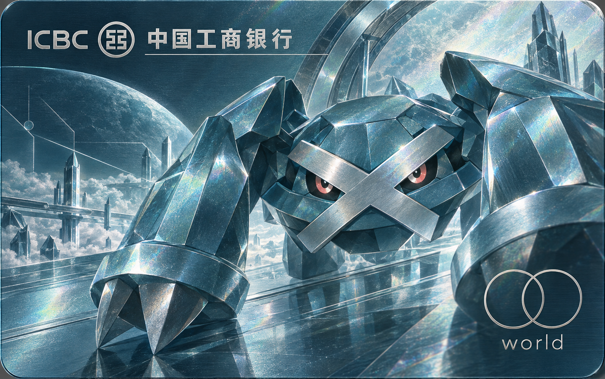

# card-creator-skill

[简体中文](README.md) | [English](README_EN.md)

[](https://skills.sh/juju-w/card-creator-skill)

一个用一句话生成 AirCard、银行卡和交通卡卡面的 Skill。图片生成工具一次完成画面与标志；
参考图库帮助模型理解 Logo，也允许烫金、单色、线稿等风格变化。无需 Python，不含在线编辑器。

## 先看作品：12 种卡面与一句话 Prompt

先看两张用户分享的 ChatGPT 网页版原图，附实际输入的 Prompt。**未核实这两次生成是否加载了 Skill**，
不将成图当作 Skill 调用成功的证明。

| 超能系粉色 · 沙奈朵 × 招商银行／银联 | 青色云母金属 · 巨金怪 × 工商银行／Mastercard World |
|---|---|
|  |  |

<details>
<summary>查看两张图的原始 Prompt</summary>

沙奈朵：

```text
使用 [juju-w/card-creator-skill](https://github.com/juju-w/card-creator-skill) card-creator Skill @创建图像 ，生成一张宝可梦里沙奈朵的卡面，简洁，超能系粉色， 招商银行银联信用卡，不要芯片
```

巨金怪：

```text
@创建图像 使用 [juju-w/card-creator-skill](https://github.com/juju-w/card-creator-skill) card-creator Skill  ，生成一张宝可梦里巨金怪的万事达 word 卡面，工商银行，不要芯片，万事达logo 不要颜色只保留线条，整体有云母/金属光泽，保持青色系
```

原始输入中的 `word` 保持原样；成图中显示的是 `world`。图片均原样保存，未裁切、重画或追加 Logo。

</details>

以下其他示例配有**已加载 Skill** 时可用的短 Prompt。没有安装 Skill 的 ChatGPT / Gemini 网页对话，
请用下方的[网页版用法](#网页版链接与参考图)；有参考图时同时上传并写“参考图如上”。

| 简洁角色卡 · 鲤鱼王 × ICOCA | 紫色科技感 · 耿鬼 × 八达通 |
|---|---|
|  |  |
| `使用 card-creator Skill，生成一张鲤鱼王 × ICOCA 卡面：简洁，右下角 ICOCA。` | `使用 card-creator Skill，生成一张耿鬼 × 八达通卡面，让八达通 Logo 变成与画面匹配的紫色。` |

| 华山水墨 · 交通联合 | 广州极简线条 · 岭南通 × 交通联合 |
|---|---|
|  |  |
| `使用 card-creator Skill，生成一张华山水墨画风格的交通卡面，右下角交通联合。` | `使用 card-creator Skill，生成一张广州极简线条卡面，包含岭南通和交通联合。` |

| 高级艺术 · 维也纳分离派 × Diners Club | 后印象派 · 旋涡夜景 × Visa |
|---|---|
|  |  |
| `使用 card-creator Skill，生成一张维也纳分离派风格的黑金高级艺术卡面，右下角哑金 Diners Club。` | `使用 card-creator Skill，生成一张深蓝旋涡夜空的后印象派卡面，右下角哑金 Visa。` |

| 清新水彩 · Chiikawa × Suica | 极简线条 · Mastercard |
|---|---|
|  |  |
| `使用 card-creator Skill，生成一张清新水彩风 Chiikawa × Suica 卡面，右下角 Suica。` | `使用 card-creator Skill，生成一张暖象牙白的极简线条 Mastercard 卡面，右下角 Mastercard。` |

| 故宫典藏 · 云母祥云与仙鹤 | 上海装饰艺术 · 夜景 × 银联 |
|---|---|
|  |  |
| `使用 card-creator Skill，生成一张故宫典藏风卡面，使用云母祥云、仙鹤、宫殿和哑金风格化标志。` | `使用 card-creator Skill，生成一张深翡翠与古金配色的上海装饰艺术卡面，右下角哑金短款银联。` |

鲤鱼王与耿鬼两张是用户提供并授权发布的 Gemini 成图原样展示，其中生成图内的 ICOCA、
JR-West 与紫色八达通标志均为非官方风格化诠释。华山、广州与故宫示例中的标志也是由 AI
结合参考图生成的非官方风格化版本。所有示例均为个人、非商业创作演示，不代表品牌、角色、交通
运营方或金融机构授权、合作或认可。图库示例保留各自的原始尺寸与比例。

## 使用方式

### 已安装 Skill：Codex 或兼容应用

应用需要同时支持 **Skill 加载**和**图片生成**。本仓库提供创作说明和参考图片，不自带生图模型；
仅仅是本地 App 或安装成功，并不代表当前会话能生图。没有图片生成工具时，不应用代码画图替代。

在支持 Agent Skills 的客户端中，使用 Vercel 开源 `skills` CLI 安装并选择对应客户端：

```bash
npx skills add juju-w/card-creator-skill
```

或下载本仓库后，在仓库根目录手动安装到 Codex：

```bash
cp -R skills/card-creator ~/.codex/skills/
```

SkillHub / WorkBuddy 简体中文版的源码与发布说明位于
[`packaging/skillhub-zh-CN`](packaging/skillhub-zh-CN/README.md)。审核上架后可运行：

```bash
skillhub install card-creator
```

确认客户端已识别 `card-creator` 后，直接使用短 Prompt：

```text
使用 card-creator Skill，生成一张宝可梦沙奈朵的招商银行银联信用卡卡面：简洁，超能系粉色，不要芯片。
```

### 网页版：链接与参考图

**在聊天框贴 GitHub 链接，不等于安装了 Skill，也不保证模型读到了说明和 PNG。**
未通过平台 Skill 入口安装时，把仓库当作参考资料使用。是否能访问链接、读取图片，以当前会话实际能力为准。

先在界面中选择图片生成功能，再发送下面这句。你的界面如果显示 `@创建图像`，选择该工具即可；
它不是需要在所有平台照抄的文字命令。ChatGPT 的图片入口见[官方说明](https://help.openai.com/en/articles/11084440)。

```text
参考 https://github.com/juju-w/card-creator-skill 中的 card-creator 说明，用图片生成功能生成一张宝可梦沙奈朵的招商银行银联信用卡卡面：简洁，超能系粉色，不要芯片。
```

读不到仓库时，直接粘贴 [SKILL.md](skills/card-creator/SKILL.md) 与简短的
[卡面规则](skills/card-creator/references/card-rules.md)，并上传需要的 Logo／角色参考图即可，不用让模型遍历仓库。
例如本例可上传[招商银行](skills/card-creator/assets/logo-references/banks/china/cmb.png)和
[短款银联](skills/card-creator/assets/logo-references/payment/unionpay-compact.png)，在 Prompt 后加“参考图如上”。

如果你的平台／工作区已经提供 Skill 安装入口，安装后按上一节使用；并非只有本地应用才能加载 Skill。
ChatGPT 的相关能力以[官方 Skill 说明](https://openai.com/academy/skills/)及账户实际入口为准。

两种用法都让图片生成工具完成整张卡面，PNG 只供参考，不用脚本绘制或事后拼贴 Logo。

## 图片与参考

默认横向卡片比例，返回图片生成工具的原始成图，不自动裁切、不附加印刷导出流程。
简短规则见 [card-rules.md](skills/card-creator/references/card-rules.md)。

- 交通参考按地区整理：中国内地、香港、日本、美国、英国、德国、澳洲。Suica 与 ICOCA 等统一放在日本目录。
- 银行参考共 30 家：包含四大行及常见商业银行、香港常用银行，以及美国、英国、新加坡、德国和澳洲银行。
- 数字钱包与金融科技：Wise、Bybit、Apple Cash、X Money，包含品牌字标／符号及 X Card 官网卡面参考。不局限于动漫角色，也可做纯排版、抽象、城市或材质主题。
- [参考图索引](skills/card-creator/references/logo-reference-index.md)直接链接实际图片；
  [完整来源与署名](SOURCES.md)在仓库外层供维护查阅，不放入 Skill。
- 感应支付标志默认不添加。仓库 MIT License 不覆盖第三方标志、角色及示例素材。

## 免责声明

本项目仅为免费、非商业的收集分享与创作交流，不出售素材，不代表品牌授权或合作。
第三方内容权利归原权利人；非盈利不构成无侵权保证。权利人可联系移除或更正，
详见[使用与权利声明](DISCLAIMER.md)。

## 验证

```bash
python3 ~/.codex/skills/.system/skill-creator/scripts/quick_validate.py skills/card-creator
python3 -m unittest discover -s tests -v
```

核心入口：[SKILL.md](skills/card-creator/SKILL.md)
