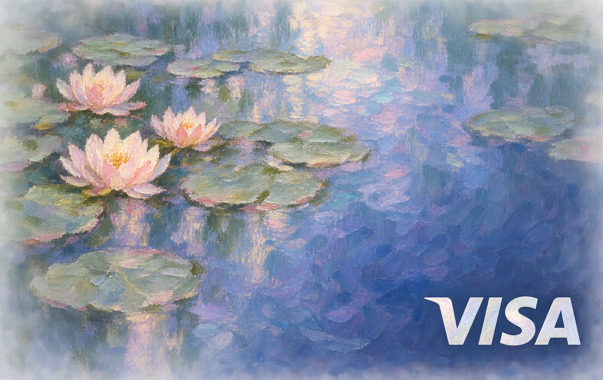
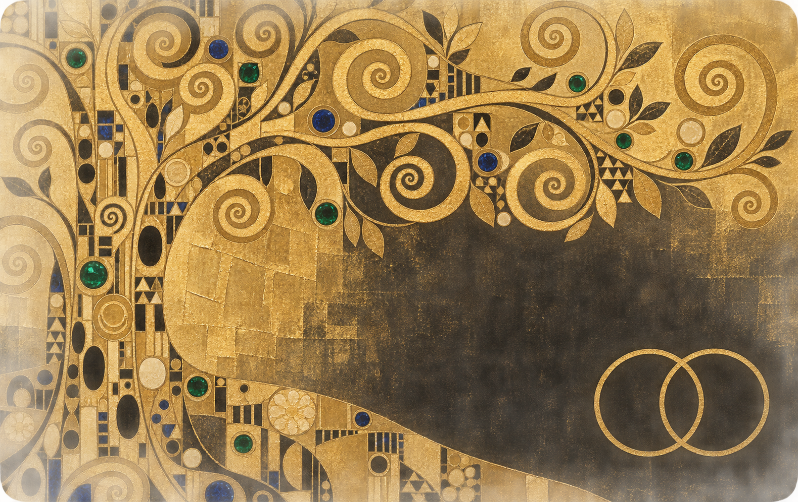
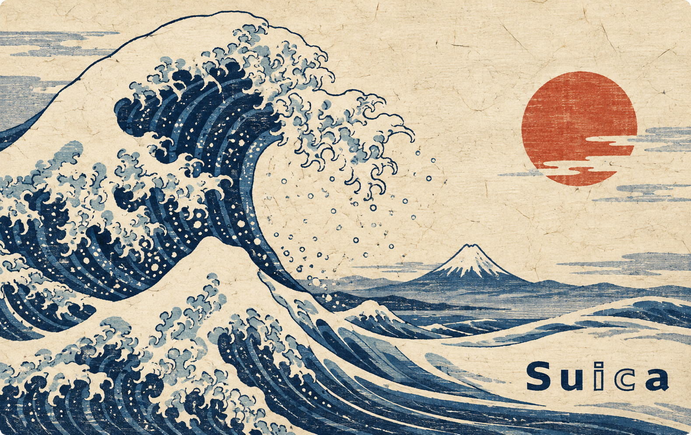
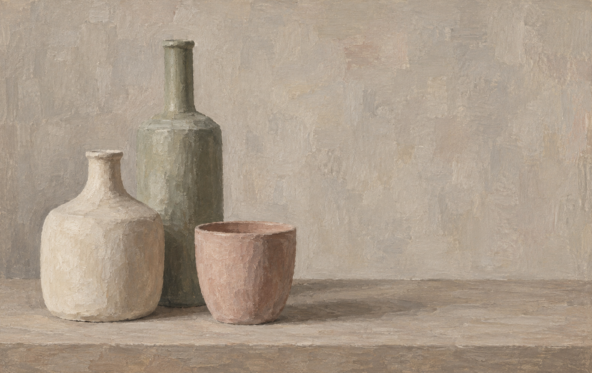
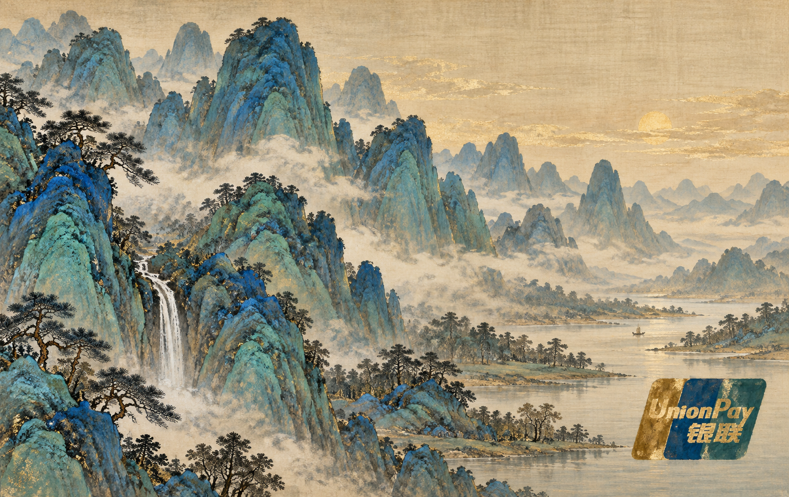

# card-creator-skill

[简体中文](README.md) | [English](README_EN.md)

[](https://skills.sh/juju-w/card-creator-skill)

A one-sentence Skill for AirCard, bank-card and transit-card artwork. Image generation creates the whole
composition, including style-matched logos. Reference pictures guide their appearance; foil, monochrome
and line-art interpretations are welcome. No Python dependency or online editor.

## Start here: eighteen card styles and one-line prompts

These first two images were shared by the user from ChatGPT on the web, with the actual prompts used.
**Skill loading was not verified for either generation**; the images are not evidence of successful Skill invocation.

| Psychic-type pink · Gardevoir × CMB / UnionPay | Cyan mica and metal · Metagross × ICBC / Mastercard World |
|---|---|
|  |  |

<details>
<summary>View the original prompts (Chinese, preserved verbatim)</summary>

Gardevoir:

```text
使用 [juju-w/card-creator-skill](https://github.com/juju-w/card-creator-skill) card-creator Skill @创建图像 ，生成一张宝可梦里沙奈朵的卡面，简洁，超能系粉色， 招商银行银联信用卡，不要芯片
```

Metagross:

```text
@创建图像 使用 [juju-w/card-creator-skill](https://github.com/juju-w/card-creator-skill) card-creator Skill  ，生成一张宝可梦里巨金怪的万事达 word 卡面，工商银行，不要芯片，万事达logo 不要颜色只保留线条，整体有云母/金属光泽，保持青色系
```

The original input says `word`; the generated image says `world`. Both images are preserved without cropping,
redrawing or adding logos. The Chinese prompts are the actual inputs, not translated reconstructions.

</details>

The remaining examples have short prompts intended for an **already-loaded Skill**. For a ChatGPT / Gemini web conversation
without an installed Skill, see [web usage](#web-usage-links-and-reference-pictures) below. Attach references when applicable.

| Impressionist water lilies · pearl-white Visa | Gilded decorative art · Mastercard |
|---|---|
|  |  |
| `Using the card-creator Skill, create a Monet-inspired water-lily card in blue and violet with subtle pearlescence and a silver-white Visa at lower right.` | `Using the card-creator Skill, create a Klimt-inspired gold-leaf card with spiral branches, jewel accents and gold-outline Mastercard at lower right.` |

| Mucha Art Nouveau · Octopus | Ukiyo-e wave · Suica |
|---|---|
|  |  |
| `Using the card-creator Skill, create a Mucha-inspired Art Nouveau card with a floral portrait and an antique-bronze Octopus mark at lower right.` | `Using the card-creator Skill, create a ukiyo-e wave card with distant Mount Fuji and indigo Suica at lower right.` |

| Morandi still life · no mark | Song blue-green landscape · UnionPay |
|---|---|
|  |  |
| `Using the card-creator Skill, create a Morandi-inspired still-life card with three ceramic vessels in dusty pink, oat and sage, without any logo.` | `Using the card-creator Skill, create a Song-style blue-green landscape card with mineral pigments, mica clouds and style-matched blue-and-gold UnionPay at lower right.` |

| Minimal character card · Magikarp × ICOCA | Purple tech · Gengar × Octopus |
|---|---|
|  |  |
| `Using the card-creator Skill, create a simple Magikarp × ICOCA card with ICOCA at lower right.` | `Using the card-creator Skill, create a Gengar × Octopus card and recolor the Octopus logo purple to match the artwork.` |

| Hua Shan ink wash · China T-Union | Guangzhou minimal line art · Lingnan Tong × China T-Union |
|---|---|
|  |  |
| `Using the card-creator Skill, create a Hua Shan ink-wash transit card with China T-Union at lower right.` | `Using the card-creator Skill, create a minimalist Guangzhou line-art card with Lingnan Tong and China T-Union.` |

| High art · Vienna Secession × Diners Club | Post-impressionist · swirling night × Visa |
|---|---|
|  |  |
| `Using the card-creator Skill, create a black-and-gold Vienna Secession card with matte-gold Diners Club at lower right.` | `Using the card-creator Skill, create a post-impressionist card with a deep-blue swirling night and matte-gold Visa at lower right.` |

| Fresh watercolor · Chiikawa × Suica | Ultra-minimal line art · Mastercard |
|---|---|
|  |  |
| `Using the card-creator Skill, create a fresh watercolor Chiikawa × Suica card with Suica at lower right.` | `Using the card-creator Skill, create a warm-ivory minimal line-art card with Mastercard at lower right.` |

| Palace collection · mica clouds and cranes | Shanghai Art Deco · night skyline × UnionPay |
|---|---|
|  |  |
| `Using the card-creator Skill, create a Palace collection card with mica clouds, cranes, architecture, and style-matched antique-gold marks.` | `Using the card-creator Skill, create a deep-jade and antique-gold Shanghai Art Deco card with compact UnionPay at lower right.` |

The six newly added art-style images were created with image generation. Their short prompts summarize a direction for an already-loaded Skill; they are not verbatim records of the full generation instructions. The Morandi design intentionally has no mark. The Magikarp and Gengar images are user-supplied Gemini outputs published with permission. Their generated
ICOCA, JR-West, and purple Octopus marks are non-official stylized interpretations. The Hua Shan, Guangzhou,
and Palace examples likewise use AI-generated marks guided by visual references. All
examples are personal, non-commercial demonstrations and do not imply authorization or endorsement. The
gallery images retain their original dimensions and aspect ratios.

## How to use

### Installed Skill: Codex or a compatible app

The client needs both **Skill loading** and **image generation**. This repository supplies instructions and
reference pictures, not an image model. A local app or a successful installation alone does not ensure
that the current session can generate images. Do not substitute code-drawn artwork when it cannot.

Install with Vercel's open-source `skills` CLI and select your compatible client:

```bash
npx skills add juju-w/card-creator-skill
```

Or download this repository and run the following from its root to install into Codex manually:

```bash
cp -R skills/card-creator ~/.codex/skills/
```

The localized SkillHub / WorkBuddy package is maintained under
[`packaging/skillhub-zh-CN`](packaging/skillhub-zh-CN/README.md). After approval, install it with:

```bash
skillhub install card-creator
```

Once the client recognizes `card-creator`, use a short prompt:

```text
Using the card-creator Skill, create a Pokémon Gardevoir card face with China Merchants Bank and UnionPay branding: minimalist, Psychic-type pink, no chip.
```

### Web usage: links and reference pictures

**Pasting a GitHub link does not install a Skill or guarantee that its instructions and PNGs were read.**
Without installation through a platform's Skill interface, treat the repository as reference material.
Link and image access depend on the capabilities of the current conversation.

Select the image-generation tool in the interface, then send the sentence below. If your interface shows
`@创建图像` or “Create image,” select that tool; this is not a universal text command to copy into every app.
See the [official ChatGPT image instructions](https://help.openai.com/en/articles/11084440).

```text
Refer to the card-creator instructions at https://github.com/juju-w/card-creator-skill and use image generation to create a Pokémon Gardevoir card face with China Merchants Bank and UnionPay branding: minimalist, Psychic-type pink, no chip.
```

If the repository cannot be read, paste [SKILL.md](skills/card-creator/SKILL.md) and the short
[card rules](skills/card-creator/references/card-rules.md), then attach the relevant logo or character images.
There is no need to scan the repository. For this example, attach
[China Merchants Bank](skills/card-creator/assets/logo-references/banks/china/cmb.png) and
[compact UnionPay](skills/card-creator/assets/logo-references/payment/unionpay-compact.png), and add “Use the attached references.”

If your platform or workspace provides Skill installation, install it and use the previous section instead;
Skill loading is not inherently limited to local apps. For ChatGPT, consult the
[official Skill guide](https://openai.com/academy/skills/) and the controls available to your account.

Both methods use image generation for the entire card. PNGs are visual references, not layers for scripts
to draw or paste onto the finished artwork.

## Images and references

Default to landscape card proportions and return the image generator's original output. There is no
automatic cropping or print-export pipeline. See the short [card rules](skills/card-creator/references/card-rules.md).

- Transit references are grouped by mainland China, Hong Kong, Japan, USA, UK, Germany and Australia.
  Suica is in the Japan directory alongside ICOCA and the other Japanese cards.
- 30 bank references cover China's Big Four and common commercial banks, Hong Kong, the USA, the UK,
  Singapore, Germany and Australia.
- Digital wallets and fintech: Wise, Bybit, Apple Cash and X Money, including brand marks and an official X Card reference. Designs can explore typography, abstraction, cities or materials—not only anime characters.
- The [picture index](skills/card-creator/references/logo-reference-index.md) links to actual files.
  [Sources and attribution](SOURCES.md) stay at the repository root, outside the installed Skill.
- Contactless indicators are opt-in. The repository's MIT License does not relicense third-party logos,
  characters or example artwork.

## Disclaimer

This free, non-commercial project shares references and creative experiments; it does not sell assets or
claim brand authorization. Third-party rights remain with their owners. Non-profit use is not a guarantee
against infringement. Rights holders may request removal or correction; see the [full notice](DISCLAIMER.md).

## Validate

```bash
python3 ~/.codex/skills/.system/skill-creator/scripts/quick_validate.py skills/card-creator
python3 -m unittest discover -s tests -v
```

Start with [SKILL.md](skills/card-creator/SKILL.md).
