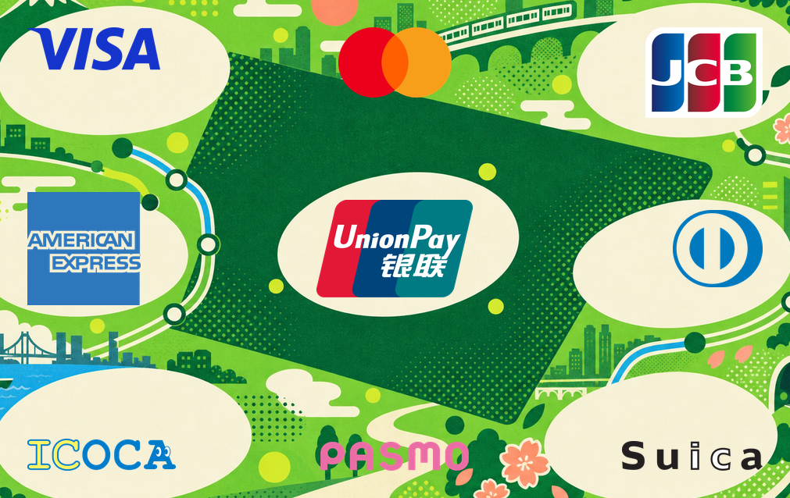
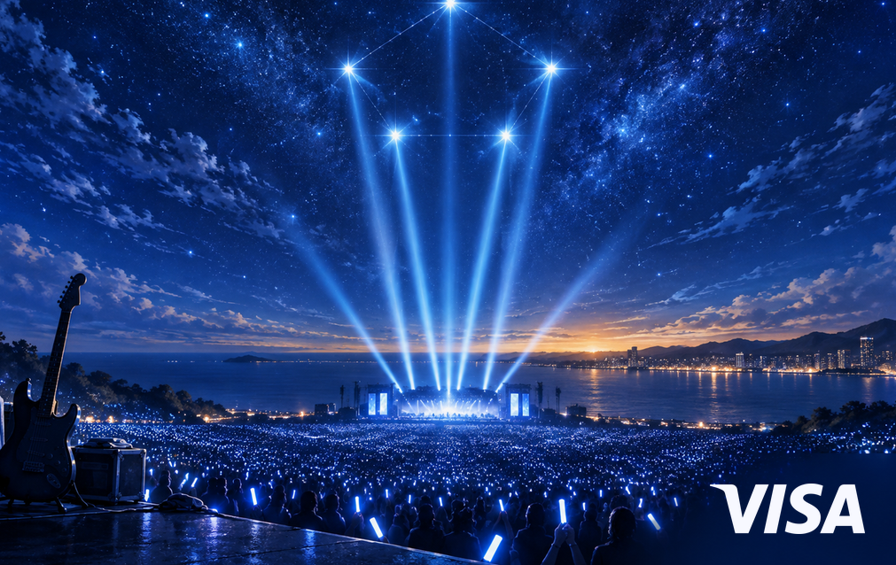

# card-creator-skill

[简体中文](README.md) | [English](README_EN.md)

[](https://skills.sh/juju-w/card-creator-skill)

A Codex Skill for creating print-ready AirCard, NFC-card, and transit-card faces. AI creates the
artwork; the Skill handles dimensions, trim, layout, transparent stickers, and 300 DPI exports.
This repository does not include an online editor.

## Start here: eight card styles and one-line prompts

Dimensions, bleed, layout, rounded-display behavior, and export rules already live in the Skill.
Paste one sentence into ChatGPT or Gemini; upload a reference in the same message when applicable.

| Fresh watercolor · Chiikawa × Suica | Parody · nine-mark super card |
|---|---|
|  |  |
| `Using the card-creator Skill and the reference image above, create a fresh, cute Chiikawa × Suica card with a spring clover meadow and watercolor-gouache texture. Use the exact Suica sticker; add no contactless mark or unrelated text.` | `Using the card-creator Skill and the meme reference above, create an absurdly dense green retro-transit logo-collage card. Use the exact Visa, Mastercard, JCB, American Express, UnionPay, Diners Club, ICOCA, PASMO, and Suica stickers; let the marks dominate the face and add no contactless mark.` |

| Mayday fan card · blue sea of stars | Post-impressionist · swirling night × Visa |
|---|---|
|  |  |
| `Using the card-creator Skill, create a Mayday fan card with a deep-blue sky, five-point constellation, ocean of blue light sticks, seaside stage, and guitar silhouette, paired with a white Visa mark. Do not copy album art, portraits, or lyrics, and add no contactless mark.` | `Using the card-creator Skill, create a premium Van Gogh-like post-impressionist card with a deep-cobalt swirling sky, golden stars, cypress trees, and vineyards, paired with a matte-gold Visa mark. Do not copy a specific painting or add a contactless mark or unrelated text.` |

| Beijing ink wash · transit marks | Ultra-minimal line art · Mastercard |
|---|---|
|  |  |
| `Using the card-creator Skill and the reference above, create a Beijing ink-wash transit card with the Temple of Heaven, Great Wall, and rice-paper texture. Add style-matched municipal-transit and China T-Union marks; add no contactless mark or unrelated text.` | `Using the card-creator Skill and the reference above, create a warm-ivory ultra-minimal line-art Mastercard card. Use the exact red-and-orange Mastercard sticker; add no contactless mark or unrelated text.` |

| Palace collection · mica clouds and cranes | Shanghai Art Deco · night skyline × UnionPay |
|---|---|
|  |  |
| `Using the card-creator Skill and the reference above, create a Palace Museum collection-style card with mica clouds, cranes, and palace architecture. Add normal Bank of China and Palace Museum lockups plus a compact UnionPay mark, all in matte antique gold; add no contactless mark.` | `Using the card-creator Skill, create a 1930s Shanghai Art Deco card with a deep-jade Bund nightscape, Huangpu reflections, geometric fans, and antique-gold linework, paired with a matte-gold compact UnionPay mark. Add no contactless mark or unrelated text.` |

The Beijing and Palace examples use disclosed non-official stylized marks. Every other example
composites only exact transparent assets whose manifest status is `ready`. All examples are personal,
non-commercial demonstrations and do not imply authorization, sponsorship, or endorsement.

## Install

Use Vercel's open-source `skills` CLI:

```bash
npx skills add juju-w/card-creator-skill
```

Or install manually:

```bash
cp -R skills/card-creator ~/.codex/skills/
python3 -m pip install -r skills/card-creator/scripts/requirements.txt
```

The localized SkillHub / WorkBuddy package is maintained under
[`packaging/skillhub-zh-CN`](packaging/skillhub-zh-CN/README.md). After approval, install it with:

```bash
skillhub install card-creator
```

## Use

Do not repeat dimensions and layout mechanics in every prompt:

```text
Using the card-creator Skill and the reference image above, create a [theme] card with [stickers] in a [style]. Add no contactless mark or unrelated text.
```

Mobile-wallet screenshots work as references. The Skill isolates the card face, ignores balances,
reader instructions, interface corners, shadows, and watermarks, and transfers design grammar into a
new composition instead of copying the original. See
[reference-card remix](skills/card-creator/references/reference-remix.md).

## Output specification

- Trim: `1011 × 638 px` at 300 DPI, representing `85.60 × 53.98 mm`.
- Full bleed: `1081 × 708 px`, with `35 px` bleed on every edge.
- The `59 px` blue guide is advisory for small functional information; it does not constrain marks,
  illustration, or full-face compositions.
- Exports include `bleed`, `trim`, and `guides` PNG files. Physical or wallet-display corner rounding is
  never baked into source artwork.
- A complete 3 × 3 anchor grid supports deliberate multi-mark collage layouts.

[card-rules.md](skills/card-creator/references/card-rules.md) is the single source of truth for dimensions
and coordinates.

## Assets and boundaries

- Ready overlays include Visa, Mastercard, American Express, UnionPay, JCB, Discover, Diners Club,
  RuPay, MIR, and Japanese transit marks including Suica, PASMO, and ICOCA.
- The manifest keeps only repository-backed `ready` and `reference-only` files; unavailable brands no
  longer create empty `blocked` rows. Missing city, bank, wallet, or payment marks are researched and
  alpha-extracted on demand, or rendered as one-off non-official interpretations when the user explicitly
  selects stylized mode. See the [sticker catalog](skills/card-creator/references/sticker-catalog.md),
  [research workflow](skills/card-creator/references/sticker-research.md), and
  [manifest](skills/card-creator/assets/stickers/manifest.json).
- `unionpay-compact` is the conventional card-corner default; Diners Club similarly uses its compact mark
  unless a full lockup is requested. Marks may dominate a corner or the full face and are not forced inside
  the advisory blue guide.
- Contactless marks are opt-in. The exact EMVCo four-wave indicator requires the applicable permission,
  and the generic Material icon is not a substitute.
- The MIT License covers original code and documentation only; it does not relicense third-party marks,
  characters, music, or example artwork.

## Validate

```bash
python3 ~/.codex/skills/.system/skill-creator/scripts/quick_validate.py skills/card-creator
python3 skills/card-creator/scripts/validate_stickers.py
python3 -m unittest discover -s tests -v
```

Start with [SKILL.md](skills/card-creator/SKILL.md).
