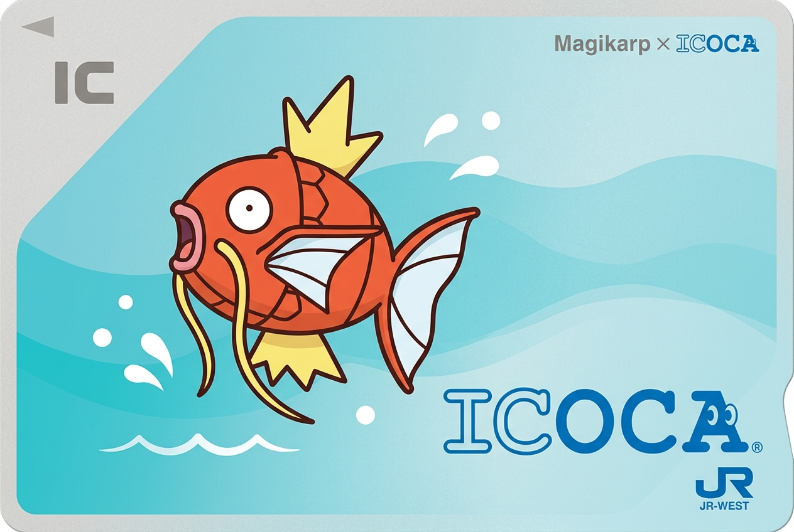
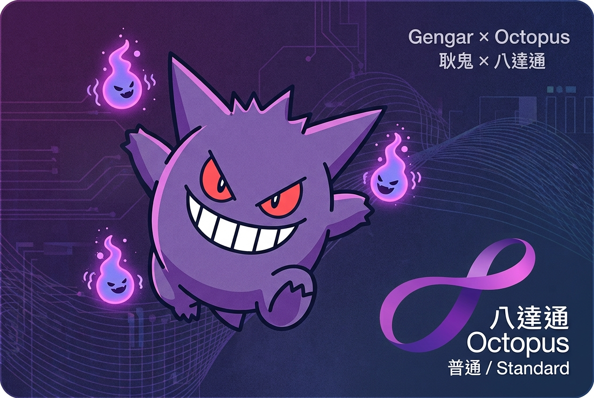
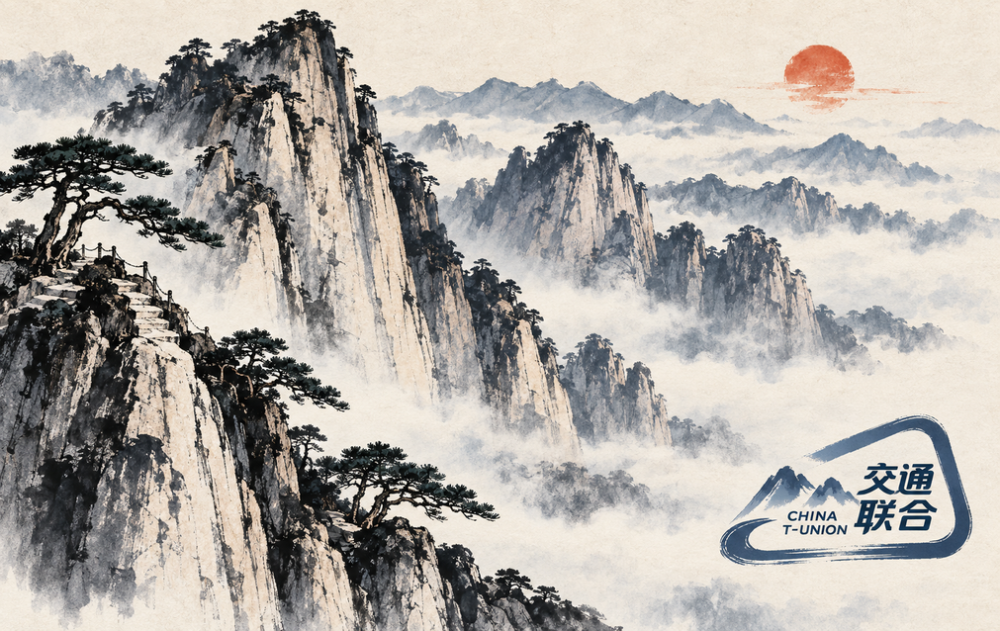
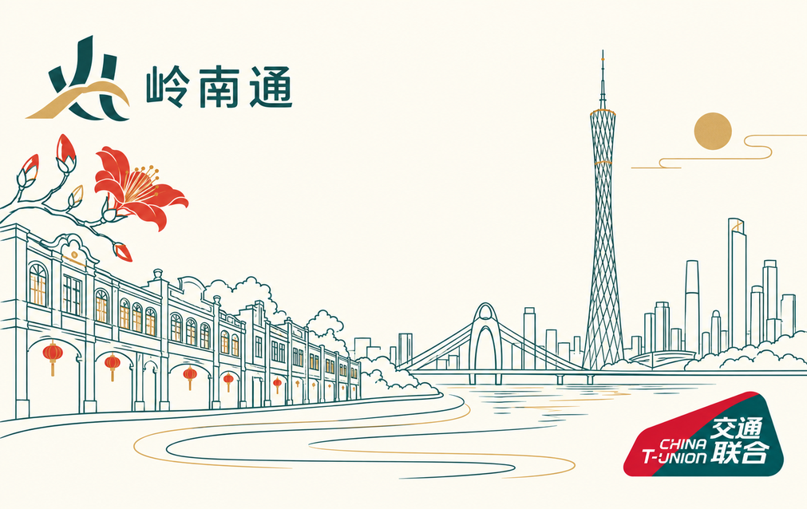
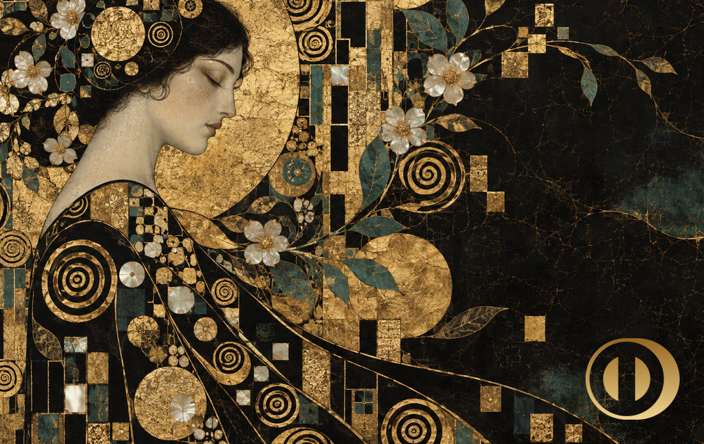
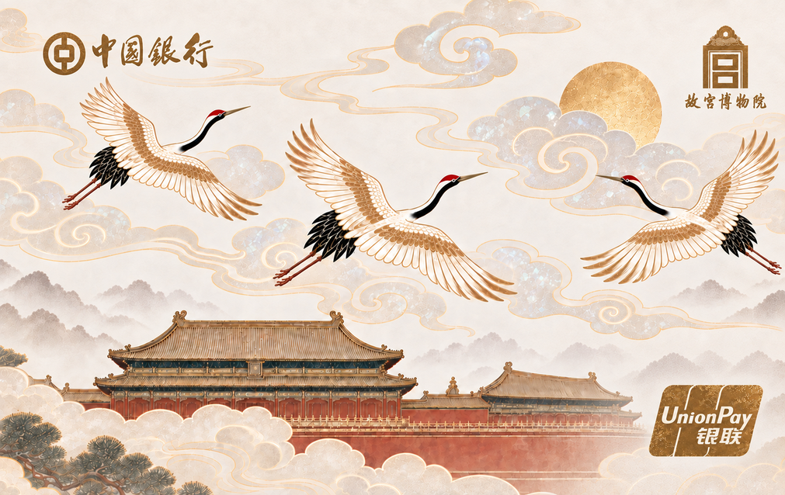
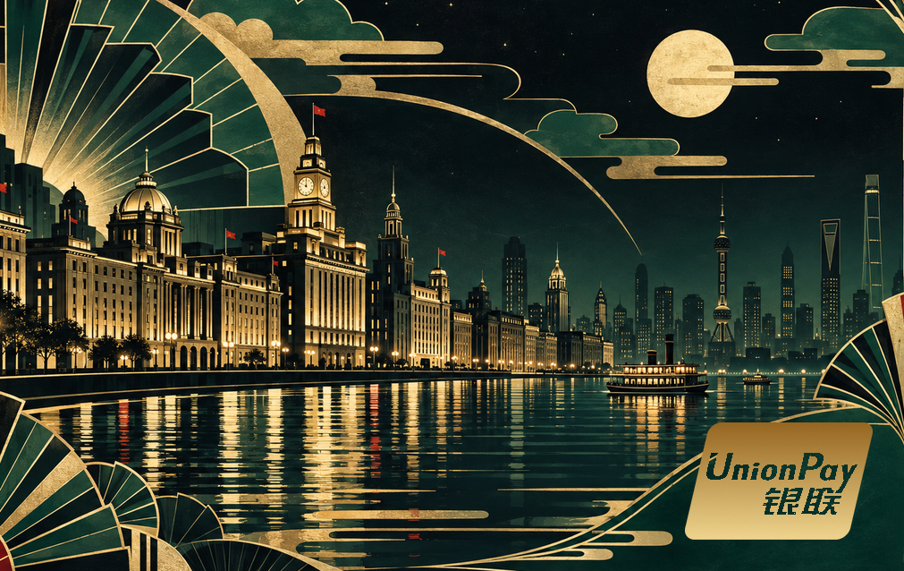

# card-creator-skill

[简体中文](README.md) | [English](README_EN.md)

[](https://skills.sh/juju-w/card-creator-skill)

A Codex Skill for creating print-ready AirCard, NFC-card, and transit-card faces. ImageGen creates the
complete artwork and marks in one pass; the Skill handles dimensions, crop checks, and 300 DPI exports.
This repository does not include an online editor.

## Start here: ten card styles and one-line prompts

Dimensions, bleed, layout, rounded-display behavior, and export rules already live in the Skill.
Paste one sentence into ChatGPT or Gemini; upload a reference in the same message when applicable.

| Minimal character card · Magikarp × ICOCA | Purple tech · Gengar × Octopus |
|---|---|
|  |  |
| `Using the card-creator Skill, create a simple Magikarp × ICOCA card with ICOCA at lower right.` | `Using the card-creator Skill, create a Gengar × Octopus card and recolor the Octopus logo purple to match the artwork.` |

| Hua Shan ink wash · China T-Union | Guangzhou minimal line art · Lingnan Tong × China T-Union |
|---|---|
|  |  |
| `Using the card-creator Skill, create a Hua Shan ink-wash transit card with China T-Union at lower right.` | `Using the card-creator Skill, create a minimalist Guangzhou line-art card with Lingnan Tong and China T-Union.` |

| High art · Vienna Secession × Diners Club | Post-impressionist · swirling night × Visa |
|---|---|
|  |  |
| `Using the card-creator Skill, create a black-and-gold Vienna Secession card with matte-gold Diners Club at lower right.` | `Using the card-creator Skill, create a post-impressionist card with a deep-blue swirling night and matte-gold Visa at lower right.` |

| Fresh watercolor · Chiikawa × Suica | Ultra-minimal line art · Mastercard |
|---|---|
|  |  |
| `Using the card-creator Skill, create a fresh watercolor Chiikawa × Suica card with Suica at lower right.` | `Using the card-creator Skill, create a warm-ivory minimal line-art card with Mastercard at lower right.` |

| Palace collection · mica clouds and cranes | Shanghai Art Deco · night skyline × UnionPay |
|---|---|
|  |  |
| `Using the card-creator Skill, create a Palace collection card with mica clouds, cranes, architecture, and style-matched antique-gold marks.` | `Using the card-creator Skill, create a deep-jade and antique-gold Shanghai Art Deco card with compact UnionPay at lower right.` |

The Magikarp and Gengar images are user-supplied Gemini outputs published with permission. Their generated
ICOCA, JR-West, and purple Octopus marks are non-official stylized interpretations. The Hua Shan, Guangzhou,
and Palace examples likewise use AI-generated marks guided by visual references. All
examples are personal, non-commercial demonstrations and do not imply authorization or endorsement. The
two Gemini images keep their original display ratio; production exports still use the Skill's
`1011 × 638 px` specification.

## Install

Use Vercel's open-source `skills` CLI:

```bash
npx skills add juju-w/card-creator-skill
```

Or install manually:

```bash
cp -R skills/card-creator ~/.codex/skills/
python3 -m pip install -r skills/card-creator/scripts/requirements.txt
```

The localized SkillHub / WorkBuddy package is maintained under
[`packaging/skillhub-zh-CN`](packaging/skillhub-zh-CN/README.md). After approval, install it with:

```bash
skillhub install card-creator
```

## Use

Image generation is the default and only artwork path: one pass creates the complete composition and its
stylized marks. The Skill does not draw cards with SVG, HTML, or scripts, and it does not split ordinary work
into “generate a background, then paste a logo.” The prompt only needs a subject, style, and mark placement:

```text
Using the card-creator Skill, create a simple Magikarp × ICOCA card with ICOCA at lower right.
```

Repository PNGs are visual references for ImageGen. The Skill opens only the one relevant to the requested
card instead of scanning the asset library.

Mobile-wallet screenshots work as references. The Skill isolates the card face, ignores balances,
reader instructions, interface corners, shadows, and watermarks, and transfers design grammar into a
new composition instead of copying the original. See
[reference-card remix](skills/card-creator/references/reference-remix.md).

## Output specification

- Trim: `1011 × 638 px` at 300 DPI, representing `85.60 × 53.98 mm`.
- Full bleed: `1081 × 708 px`, with `35 px` bleed on every edge.
- The `59 px` blue guide is advisory for small functional information; it does not constrain marks,
  illustration, or full-face compositions.
- Exports include `bleed`, `trim`, and `guides` PNG files. Physical or wallet-display corner rounding is
  never baked into source artwork.
- ImageGen handles deliberate multi-mark layouts as part of the complete composition.

[card-rules.md](skills/card-creator/references/card-rules.md) is the single source of truth for dimensions
and coordinates.

## Assets and boundaries

- The repository keeps PNG references for common payment, transit, and city-card marks. They guide ImageGen
  and are not exact overlays. See the
  [logo reference index](skills/card-creator/references/logo-reference-index.md).
- UnionPay and Diners Club may use compact or full compositions according to card convention. Marks may
  dominate a corner or the full face and are not forced inside the advisory blue guide.
- Contactless marks are opt-in. The exact EMVCo four-wave indicator requires the applicable permission,
  and the generic Material icon is not a substitute.
- The MIT License covers original code and documentation only; it does not relicense third-party marks,
  characters, music, or example artwork.

## Validate

```bash
python3 ~/.codex/skills/.system/skill-creator/scripts/quick_validate.py skills/card-creator
python3 -m unittest discover -s tests -v
```

Start with [SKILL.md](skills/card-creator/SKILL.md).
